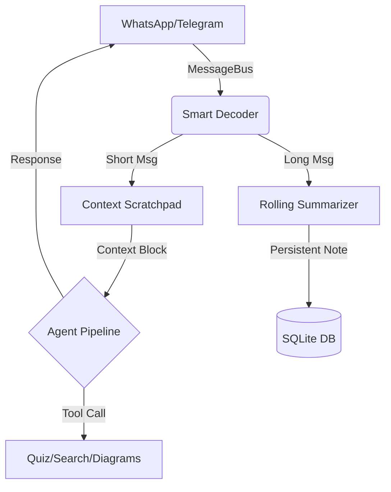

<div align="center">

<h1>🦞 StudyClaw</h1>
<p><strong>Ultra-lightweight AI Study Agent for Phones & PCs</strong></p>

[](LICENSE)
[](https://golang.org/dl/)
[]()
[]()
[]()

<p>
  <a href="#-quick-start">Quick Start</a> •
  <a href="#-features">Features</a> •
  <a href="#-architecture">Architecture</a> •
  <a href="#-configuration">Setup</a>
</p>

</div>

---

**StudyClaw** is a production-grade, autonomous AI tutor designed for 4GB RAM devices. It turns **WhatsApp** and **Telegram** into a personalized learning cockpit, proactively monitoring group chats, summarizing academic materials, and generating adaptive quizzes using the high-speed **PicoClaw Architecture**.

> [!IMPORTANT]
> **TELE UPDATE (March 2026)**: StudyClaw now fully supports Telegram! You can now use all AI features through a dedicated Telegram bot, providing an even more stable and lightweight experience than WhatsApp.

## ✨ Pro Features

| Feature                         | The StudyClaw Edge                                                                              |
| :------------------------------ | :---------------------------------------------------------------------------------------------- |
| 🧠**Context Scratchpad**  | Zero-memory overhead context injection using 1000-token rolling summaries.                      |
| 🔋**Termux Optimized**    | Pre-built binaries +`termux-wake-lock` integration for 24/7 background uptime on Android.     |
| 🛑**Remote Shutdown**     | Send `!stop` from your phone to instantly kill the process and save 100% battery/RAM.         |
| 🎓**Dynamic Memory**      | Tracks your Semester, University, and weak topics to adapt every AI response to your syllabus.  |
| 🎯**Adaptive Quizzes**    | MCQs generated on-the-fly from your college group's long messages or uploaded PDFs.             |
| 📐**Visual Intelligence** | Instant Flowcharts, ERDs, and Circuit schematics rendered via a local web viewer.               |
| 🎓**Passive Monitoring**  | Silently "listens" to teacher groups and sends private summaries to you—never spams the group. |
| 🔍**Conversational RAG** | Ask questions about your own notes/PDFs. Uses conversational memory to refine searches.    |
| 📅**Smart Calendar**     | AI-powered scheduling. Add events, deadlines, and get reminders directly in chat.          |
| 🧠**Autonomous Memory**  | AI remembers your learning pace, weak topics, and style across different sessions.         |

---

## 🏗️ PicoClaw Architecture

StudyClaw uses a **Zero-CGO** design, ensuring native performance on ARM64 (Phones) and x64 (Windows).



---

## 🚀 Quick Start

### 📱 Termux (Fastest for Phones)

```bash
pkg update && pkg install golang git -y
git clone https://github.com/roshan30-git/picoclaw-scholar.git
cd picoclaw-scholar && chmod +x run.sh && ./run.sh
```

### 💻 Windows (Zero-Setup)

For the easiest experience on Windows, use the built-in orchestrator script. It handles dependency checks, environment setup, and launching automatically.

```powershell
git clone https://github.com/roshan30-git/picoclaw-scholar.git
cd picoclaw-scholar
.\run.ps1
```

---

## 🔑 Configuration (.env)

| Key                        | Description           | Get it at                                    |
| :------------------------- | :-------------------- | :------------------------------------------- |
| `GEMINI_API_KEY`         | Core AI Brain         | [AI Studio](https://aistudio.google.com/apikey) |
| `TELEGRAM_BOT_TOKEN`     | Bot identity          | [@BotFather](https://t.me/botfather)            |
| `STUDYCLAW_OWNER_NUMBER` | Remote Command Access | Your mobile number                           |

### 🛠️ Elite Commands

- **`!stop`**: Shut down the bot remotely (Owner only).
- **`@librarian` persona**: Focuses on deep indexing and PDF analysis.
- **`@drill_sergeant` persona**: Forces a rigorous, high-intensity quiz mode.

---

## 🔧 Troubleshooting

### 🛑 429 Quota Exceeded / "Thinking..." Stuck
If you are using a **Free Tier** Gemini API Key from Google AI Studio, you may encounter rate limits (429 errors) if you send messages too quickly.
- **Symptoms**: The bot replies with an error message or briefly stops responding.
- **Solution**: Wait 60 seconds for the free quota to reset. StudyClaw now includes a "Connection Failed" fallback message to prevent permanent hangs.
- **Pro Tip**: Use the Telegram channel for a more reliable, lightweight experience.

---

## 📄 License & Copyleft

StudyClaw is licensed under the **GNU General Public License v3.0**.

> This ensures the project remains free and open-source forever. Any derivative works must be shared under the same license.

---

<div align="center">
<b>StudyClaw</b> — Built by students, for students. Learn Boldly. 🦞
</div>
