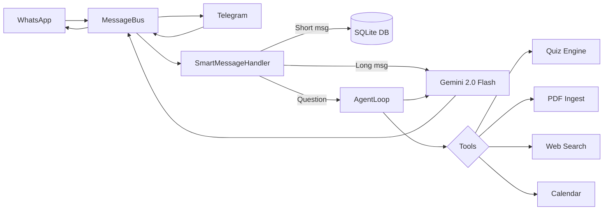

<div align="center">

<h1>🦞 StudyClaw</h1>
<p><strong>Autonomous AI study agent — lives in WhatsApp & Telegram</strong></p>

[](LICENSE)
[](https://golang.org/dl/)
[]()
[]()
[]()

</div>

---

**StudyClaw** is an open-source, self-hosted AI agent that runs on your Windows PC or Android phone (via Termux). It connects to **WhatsApp** and **Telegram**, monitors your college group for new content, and proactively quizzes, summarizes, and informs you — powered by **Gemini 2.0 Flash**.

> [!TIP]
> **Use Telegram for the fastest experience!** Instant setup (no QR scan), faster responses, and better message formatting. Perfect for quick quiz checks and AI queries.

---

## ✨ Features

| Feature | Description |
|:--------|:------------|
| 🧠 **Smart Message Routing** | Short msgs (≤120 chars) are indexed silently. Long messages are AI-summarized into 3 key bullets with *"Want more?"* |
| 🌐 **Web Search** | Real-time internet search via DuckDuckGo — no API key needed. Agent uses it automatically for current events. |
| 📥 **PDF & Image Ingestion** | Drop files in the chat. Auto-indexed for retrieval and quiz generation. |
| 🎯 **Adaptive Quizzes** | MCQs generated from your own notes. Adapts difficulty based on quiz history. |
| 📊 **Excel Export** | Ask the agent to export deadlines, quiz scores, or notes — downloads a `.xlsx` spreadsheet. |
| 📐 **Diagrams & Circuits** | Ask for any flowchart, ER diagram, sequence diagram, mindmap, circuit schematic. Rendered at `localhost:8080`. |
| 🎓 **Dynamic Student Memory** | Per-student learning profile: tracks weak topics, pace, and style. Every AI response adapts to your profile. |
| 📅 **Proactive Reminders** | Daily 8 AM deadline briefings. Weekly Sunday flashcard drops. Fully automated cron scheduler. |
| 🔒 **Group Privacy** | **Passive Mode** — bot reads your college group silently, never replies. AI responses come to you privately. |
| 🤖 **Dual-Channel** | Telegram (recommended) + WhatsApp with full feature parity. |

---

## 🏗️ Architecture



---

## 🚀 Quick Start

### Windows (Recommended)

```powershell
git clone https://github.com/roshan30-git/picoclaw-scholar.git
cd picoclaw-scholar
.\run.ps1
```

The setup wizard will ask for your Gemini API key and Telegram token.

### Termux (Android)

```bash
pkg update && pkg install golang git -y
git clone https://github.com/roshan30-git/picoclaw-scholar.git
cd picoclaw-scholar
chmod +x run.sh && ./run.sh
```

---

## 🔑 Getting Your Keys

| Service | URL | Required? |
|---------|-----|-----------|
| Gemini API | [aistudio.google.com/apikey](https://aistudio.google.com/apikey) | ✅ Yes |
| Telegram Bot | [@BotFather](https://t.me/botfather) on Telegram | ⭐ Recommended |
| WhatsApp | Scan QR on first launch | Optional |

---

## ⚙️ Configuration

Edit `.env` (automatically created by `run.ps1` / `run.sh`):

```env
GEMINI_API_KEY=AIza...                  # Required
TELEGRAM_BOT_TOKEN=...                  # Recommended
STUDYCLAW_OWNER_NUMBER=91XXXXXXXXXX     # Your WhatsApp number
STUDYCLAW_ALLOWED_GROUPS=...            # Comma-sep JIDs (see terminal on start)
STUDYCLAW_PASSIVE_GROUPS=...            # Groups the bot reads but never replies in
LLM_PROVIDER=gemini
```

> [!NOTE]
> Run the app once to see a **📋 Joined WhatsApp Groups** list in the terminal — this shows you the JIDs you need for group filtering.

---

## 🔒 WhatsApp Privacy

StudyClaw gives you full control over group access:

| Mode | How | Effect |
|------|-----|--------|
| **Active** | Add group JID to `STUDYCLAW_ALLOWED_GROUPS` | Bot reads and replies |
| **Passive** | Add group JID to `STUDYCLAW_PASSIVE_GROUPS` | Bot reads silently, sends AI responses to you privately |
| **Blocked** | Leave group JIDs empty | Bot ignores all groups |

---

## 🗺️ Roadmap

- [x] WhatsApp & Telegram integration
- [x] Gemini tool calling & PDF ingestion
- [x] Windows one-click launcher (`run.ps1`)
- [x] Termux launcher (`run.sh`)
- [x] Smart message routing & summarization
- [x] Real-time web search via DuckDuckGo
- [x] Passive group monitoring mode
- [x] Academic calendar & reflection engine
- [ ] Handwriting OCR (Surya)
- [ ] Exam countdown alerts with push notifications
- [ ] Multi-language support

---

## 🤝 Contributing

Contributions welcome! Please read `CONTRIBUTING.md` before submitting a PR.

1. Fork the repository
2. Create a feature branch: `git checkout -b feat/my-feature`
3. Commit your changes: `git commit -m 'feat: add my feature'`
4. Push and open a Pull Request

---

## 📄 License

StudyClaw is licensed under the **[GNU General Public License v3.0](LICENSE)**.

> This means any derivative work must also be open-sourced under GPLv3 — keeping StudyClaw free for everyone.

---

<div align="center">
Made with ☕ & Go. Learn boldly 🦞
</div>
