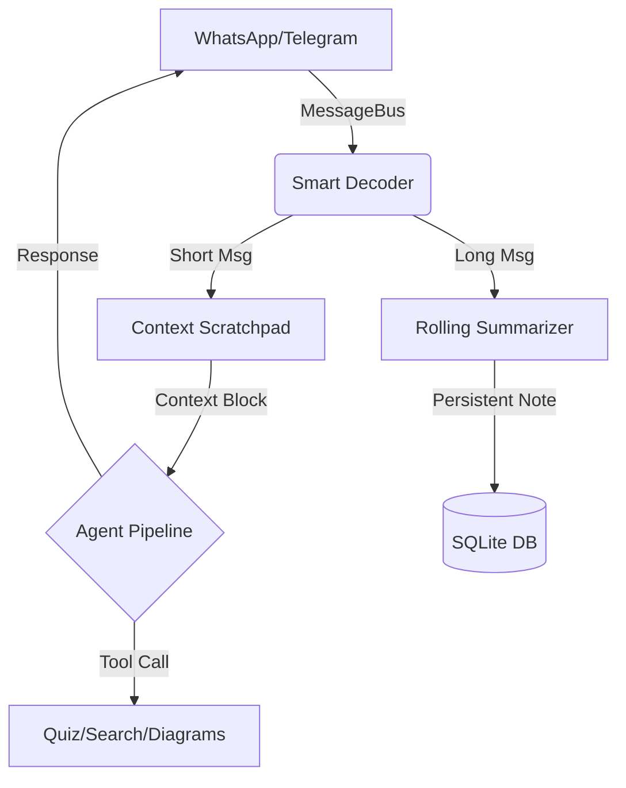

<div align="center">

<h1>🦞 StudyClaw</h1>
<p><strong>Ultra-lightweight AI Study Agent for Phones & PCs</strong></p>

[](LICENSE)
[](https://golang.org/dl/)
[]()
[]()
[]()

<p>
  <a href="#-quick-start">Quick Start</a> •
  <a href="#-features">Features</a> •
  <a href="#-architecture">Architecture</a> •
  <a href="#-configuration">Setup</a>
</p>

</div>

---

**StudyClaw** is a production-grade, autonomous AI tutor designed for 4GB RAM devices. It turns **WhatsApp** and **Telegram** into a personalized learning cockpit, proactively monitoring group chats, summarizing academic materials, and generating adaptive quizzes using the high-speed **PicoClaw Architecture**.

> [!IMPORTANT]
> **TELE UPDATE (March 2026)**: StudyClaw now fully supports Telegram! You can now use all AI features through a dedicated Telegram bot, providing an even more stable and lightweight experience than WhatsApp.

## ✨ Pro Features

| Feature                         | The StudyClaw Edge                                                                              |
| :------------------------------ | :---------------------------------------------------------------------------------------------- |
| 🧠**Context Scratchpad**  | Zero-memory overhead context injection using 1000-token rolling summaries.                      |
| 🔋**Termux Optimized**    | Pre-built binaries +`termux-wake-lock` integration for 24/7 background uptime on Android.     |
| 🛑**Remote Shutdown**     | Send `!stop` from your phone to instantly kill the process and save 100% battery/RAM.         |
| 🎓**Dynamic Memory**      | Tracks your Semester, University, and weak topics to adapt every AI response to your syllabus.  |
| 🎯**Adaptive Quizzes**    | MCQs generated on-the-fly from your college group's long messages or uploaded PDFs.             |
| 📐**Visual Intelligence** | Instant Flowcharts, ERDs, and Circuit schematics rendered via a local web viewer.               |
| 🎓**Passive Monitoring**  | Silently "listens" to teacher groups and sends private summaries to you—never spams the group. |
| 🔍**Conversational RAG** | Ask questions about your own notes/PDFs. Uses conversational memory to refine searches.    |
| 📅**Smart Calendar**     | AI-powered scheduling. Add events, deadlines, and get reminders directly in chat.          |
| 🧠**Autonomous Memory**  | AI remembers your learning pace, weak topics, and style across different sessions.         |

---

## 🏗️ PicoClaw Architecture

StudyClaw uses a **Zero-CGO** design, ensuring native performance on ARM64 (Phones) and x64 (Windows).



---

---

## 🚀 Installation & Deployment

StudyClaw is cross-platform by design. Choose the method that best fits your workflow.

### 💻 Windows (Desktop)

#### Method 1: The One-Click Orchestrator (Recommended)
This method auto-detects your environment, installs missing tools, and configures everything via a web wizard.
1. Open PowerShell and run:
   ```powershell
   git clone https://github.com/roshan30-git/picoclaw-scholar.git
   cd picoclaw-scholar
   .\run.ps1
   ```
2. Navigate to `http://localhost:8080/setup` to link your bot.

#### Method 2: Manual Build (For Developers)
If you prefer full control over your environment:
1. Clone the repo and install dependencies:
   ```powershell
   go mod tidy
   ```
2. Create a `.env` file (see [Configuration](#-advanced-configuration)).
3. Build and run:
   ```powershell
   go build -o studyclaw.exe ./cmd
   .\studyclaw.exe
   ```

#### Method 3: Binary Release
Download the [Pre-compiled Binary](https://github.com/roshan30-git/picoclaw-scholar/releases), extract it, and run `studyclaw.exe`.

---

### 📱 Termux (Mobile Integration)

Optimized for ARM64 with built-in `termux-wake-lock` support to prevent Android from killing the bot.
```bash
pkg update && pkg install golang git clang make -y
git clone https://github.com/roshan30-git/picoclaw-scholar.git
cd picoclaw-scholar && chmod +x run.sh && ./run.sh
```

---

## 🏗️ System Architecture

StudyClaw follows the **PicoClaw Blueprint**—a modular architecture designed for high throughput and low memory usage.

### Directory Structure
```text
├── cmd/                # Entry points (main application)
├── integrations/       # Platform bridges (WhatsApp, Telegram)
├── pkg/
│   ├── agent/          # Core AI logic & Persona Router
│   ├── channels/       # Message abstraction layer
│   ├── providers/      # LLM API implementations (Gemini, etc.)
│   ├── study/          # Features: RAG, Search, Summarization
│   ├── tools/          # AI Tool implementations (Calendar, Quiz)
│   ├── database/       # SQLite WAL-mode persistence
│   └── viewer/         # Local web server for visualizations
├── docs/               # Landing page & Documentation
└── workspace/          # User data, prompts, and temporary files
```

### Module Breakdown
- **Zero-CGO SQLite**: Uses `modernc.org/sqlite` for 100% Go compatibility, enabling zero-setup installations on Windows.
- **WAL Persistence**: Database is configured with Write-Ahead Logging to prevent lockups during heavy message syncs.
- **Pico-Summarization**: Long group messages are processed in chunks to keep AI context windows efficient.

---

## 🔑 Advanced Configuration

While the **Web Setup Wizard** is the easiest way to configure StudyClaw, you can manually edit the `.env` file for advanced tuning:

| Variable | Description | Default |
| :--- | :--- | :--- |
| `GEMINI_API_KEY` | Your Google AI Studio Key | *Required* |
| `TELEGRAM_APITOKEN` | Your BotFather Token | *Optional* |
| `STUDY_PORT` | Port for the web UI & Visualization | `8080` |
| `DATABASE_PATH` | Path to the SQLite store | `./studyclaw.db` |
| `PASSIVE_GROUPS` | CSV of Group IDs to index silently | `""` |

---

## 🤖 Elite Commands & Personas

Interacting with StudyClaw is more than just chatting. Use specialized **Personas** to change the bot's behavior:

- **`!persona status`**: Check current active persona.
- **`@librarian`**: Use this prefix for deep indexing. The bot will focus on technical accuracy and PDF reference.
- **`@drill_sergeant`**: Activates "Challenge Mode". The bot will ignore casual chat and only ask difficult quiz questions.
- **`@mentor`**: (Default) Provides balanced support with encouraging feedback.

---

## 🛠️ Performance & Tuning

- **Low Data Mode**: In your Telegram bot settings, limit document downloads to prevent high bandwidth usage.
- **Rate Limiting**: If you encounter `429 Too Many Requests`, the bot will automatically notify you. We recommend spreading out complex queries by at least 10 seconds.
- **Memory Usage**: StudyClaw typically consumes `< 40MB` RAM. If usage spikes, use `!stop` and restart to clear the internal scratchpad.

---

## 🔧 Troubleshooting

### 🛑 429 Quota Exceeded / "Thinking..." Stuck
If you are using a **Free Tier** Gemini API Key from Google AI Studio, you may encounter rate limits (429 errors) if you send messages too quickly.
- **Symptoms**: The bot replies with an error message or briefly stops responding.
- **Solution**: Wait 60 seconds for the free quota to reset. StudyClaw now includes a "Connection Failed" fallback message to prevent permanent hangs.
- **Pro Tip**: Use the Telegram channel for a more reliable, lightweight experience.

---

## 📄 License & Copyleft

StudyClaw is licensed under the **GNU General Public License v3.0**.

> This ensures the project remains free and open-source forever. Any derivative works must be shared under the same license.

---

---

## 🤝 Contributing & Community

We welcome contributions from students and developers! 
- **Bug Reports**: Open an issue if something breaks.
- **Feature Requests**: Have an idea for a new study tool? Let us know.
- **Code**: PRs are welcome. Please ensure your code follows the "PicoClaw" philosophy: low memory, modular, and well-documented.

### Top Contributors
- [Roshan](https://github.com/roshan30-git) — Core Architect
- [Community Contributor] — Bug fixes & UI Polish

---

<div align="center">
<b>StudyClaw</b> — Built by students, for students. Learn Boldly. 🦞
</div>
